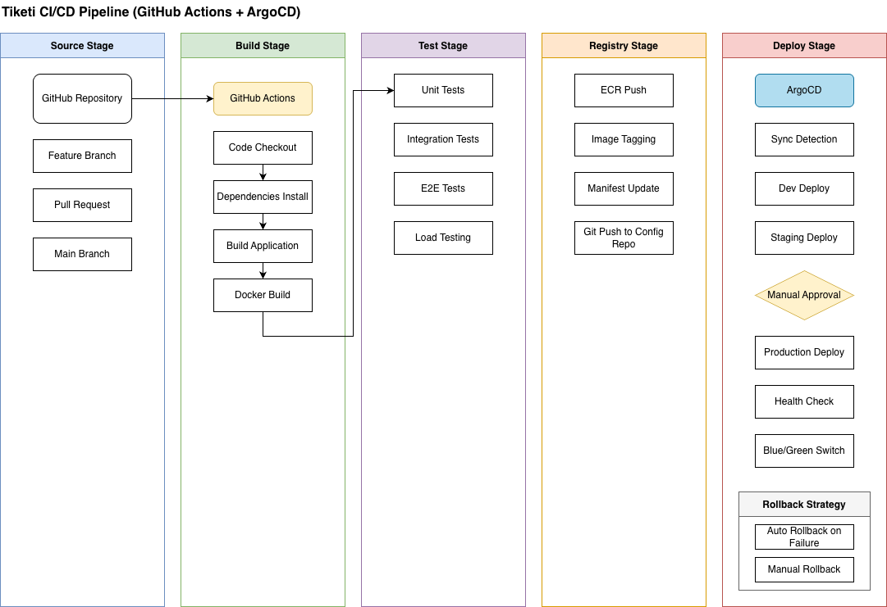
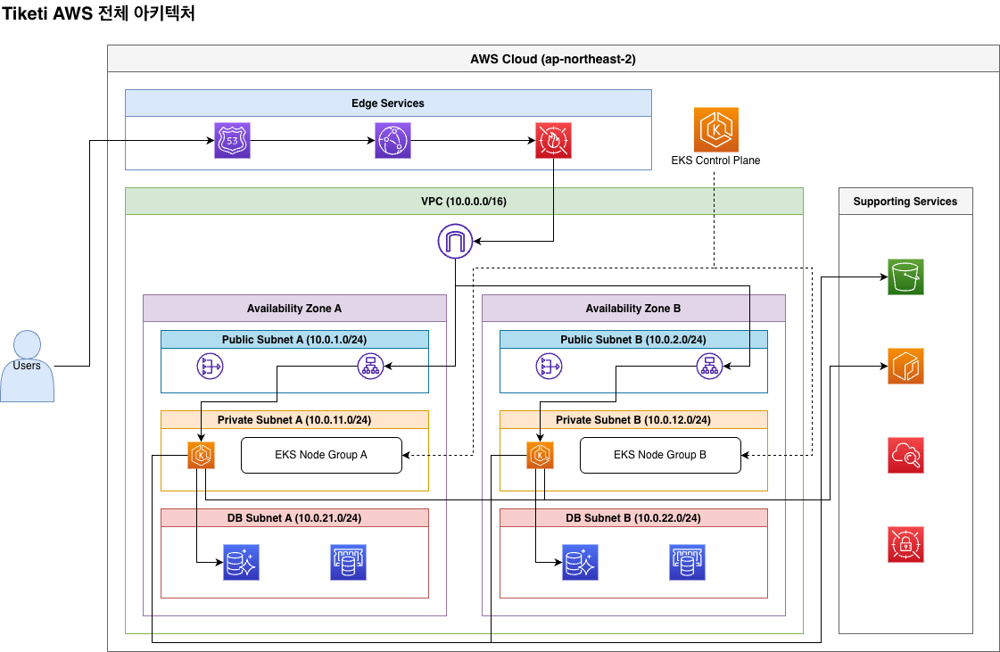
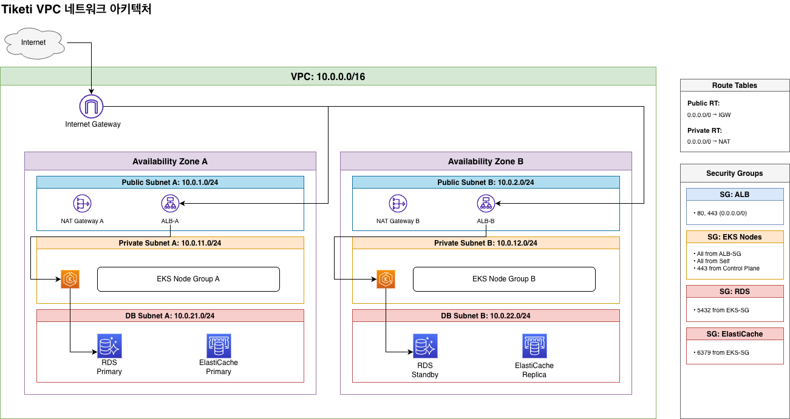
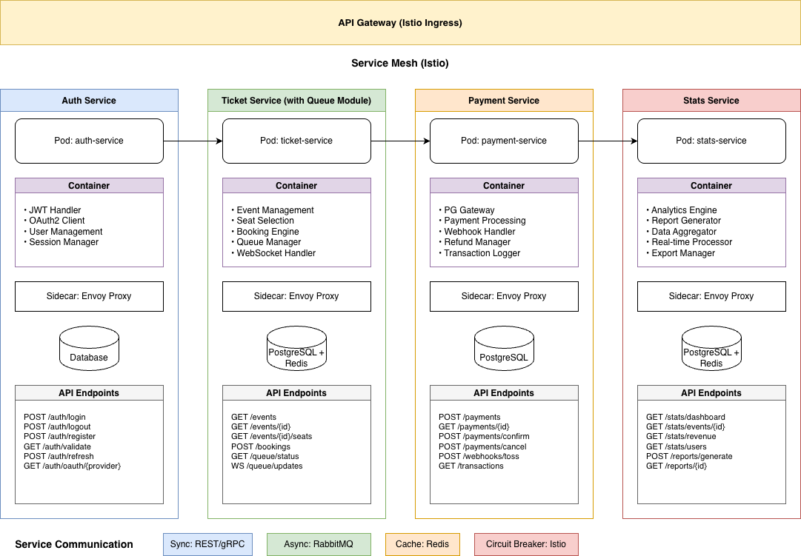
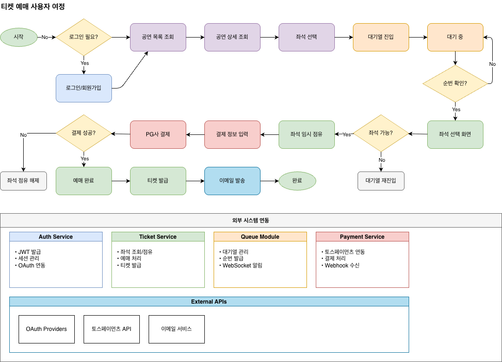
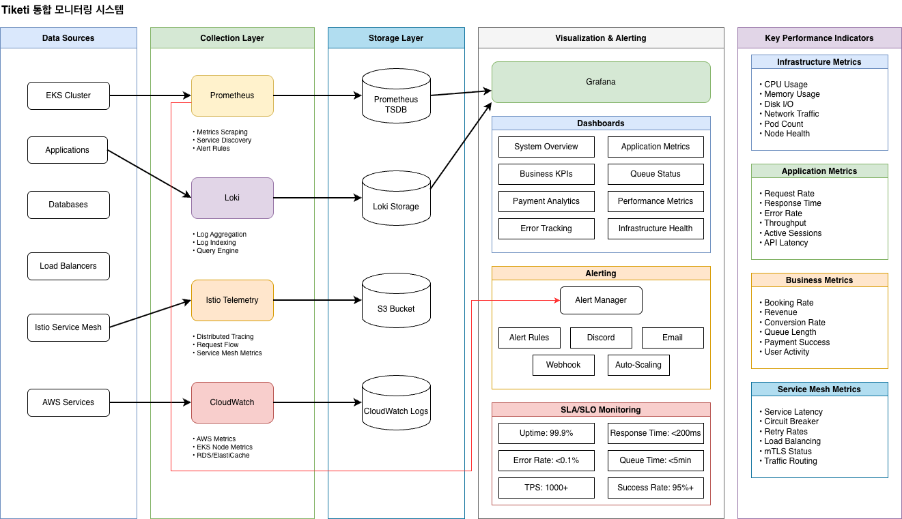

# 4팀 - 티켓팅 예약관리 플랫폼 “티케티(Tiketi)”

---

## INDEX

1. 프로젝트 개요
2. MSA 아키텍처 분석
3. 아키텍처 다이어그램
4. 향후 계획

---

## 1. 프로젝트 개요

### 1.1 프로젝트 소개

**TIKETI**는 대규모 동시접속을 처리할 수 있는 클라우드 네이티브 티켓팅 플랫폼입니다. 서버가 가장 취약해지기 쉬운 티켓팅 플랫폼 특성상 티켓 오픈 시간 등 특정 시간대에 트래픽이 엄청나게 몰리는 상황을 성공적으로 처리할 수 있는 아키텍처를 구축하는것이 목표입니다.

### 목적
- Docker Compose → Kubernetes/EKS 전환으로 무한 확장성 확보
- MSA 아키텍처 도입으로 서비스별 독립적 확장
- 대기열 시스템 고도화로 10,000명 동시접속 처리
- ArgoCD 도입으로 GitOps 기반 자동 배포 완성

---

### **핵심 비즈니스 기능:**
- 이벤트 조회 및 검색
- 실시간 좌석 선택
- 대기열 시스템 (트래픽 제어)
- 온라인 결제 (TossPayments 연동)
- 예매 내역 관리
- 관리자 대시보드

---

### 기본 프로젝트 (As-Is) vs 심화 프로젝트 (To-Be)

| 구분 | As-Is | To-Be |
|------|-------|--------|
| **인프라** | Docker Compose (단일 EC2) | AWS EKS (Multi-AZ) |
| **아키텍처** | 모놀리식 | MSA (Auth/Ticket/Payment/Stats) |
| **확장성** | 수동 스케일링 | HPA/KEDA 자동 스케일링 |
| **동시접속** | 500명 | 10,000명 |
| **처리량** | 50 TPS | 1,000 TPS |
| **CI/CD** | GitHub Actions | GitHub Actions + ArgoCD |
| **모니터링** | Grafana (별도) | 통합 대시보드 |
| **결제** | 미구현 | 토스페이먼츠 샌드박스 연동 |


---

## 1.2 진행 상태

| 구분 | As-Is (기본) | To-Be (심화) | **달성도** |
|------|-------------|-------------|-----------|
| **인프라** | Docker Compose | AWS EKS | ✅ **100%** |
| **아키텍처** | 모놀리식 | MSA (4개 서비스) | ✅ **100%** |
| **확장성** | 수동 스케일링 | HPA/KEDA 자동 | ✅ **90%** |
| **동시접속** | 500명 | 10,000명 | 🔄 **70%** |
| **처리량** | 50 TPS | 1,000 TPS | 🔄 **60%** |
| **CI/CD** | GitHub Actions | + ArgoCD | ✅ **90%** |
| **결제** | 미구현 | 토스페이먼츠 연동 | ✅ **100%** |

**📊 전체 진행률: 약 87%**

---

# 2. MSA 아키텍처 분석

## 2.1 서비스 분리 전략

### 도메인 기반 분리 (Domain-Driven Design)

```
🔐 Auth Service (포트 3002)
   └── 사용자 인증 및 권한 관리

🎫 Ticket Service (포트 3004)  
   └── 이벤트, 티켓, 좌석, 예약, 대기열 관리

💳 Payment Service (포트 3003)
   └── 결제 처리 및 토스페이먼츠 연동

📊 Stats Service (포트 3005)
   └── 통계 및 리포팅
```

---

## 2.2 Auth Service (인증 서비스)

### ✅ 완료된 기능
- 사용자 회원가입/로그인
- Google OAuth 인증  
- JWT 토큰 발급 및 검증
- 사용자 정보 관리

### 주요 API 엔드포인트
```
POST /auth/register        # 회원가입
POST /auth/login           # 로그인  
POST /auth/google          # Google OAuth 로그인
POST /auth/verify-token    # 토큰 검증 (서비스 간 통신용)
GET  /auth/me              # 현재 사용자 정보
```

---

## 2.3 Ticket Service (티켓/이벤트 서비스)

### ✅ 완료된 기능
- 이벤트 CRUD 및 검색
- 실시간 좌석 선택 (Socket.IO)
- Redis 기반 대기열 시스템
- 백그라운드 큐 프로세서

### 핵심 구현 특징

#### 1. **실시간 WebSocket 통신**
```javascript
// 클라이언트 → 서버
socket.emit('join-event', { eventId })
socket.emit('join-queue', { eventId })

// 서버 → 클라이언트  
socket.on('seat-locked', (data) => { /* 좌석 잠금 알림 */ })
socket.on('queue-updated', (data) => { /* 대기열 업데이트 */ })
```

#### 2. **Redis 활용**
- 좌석 잠금 관리 (TTL 설정)
- 대기열 관리 (Sorted Set)
- Socket.IO Adapter (멀티 인스턴스 동기화)

---

## 2.4 Payment Service (결제 서비스)

### ✅ 완료된 기능
- 토스페이먼츠 API 연동
- 결제 승인/취소/환불
- 트랜잭션 관리
- 결제 로그 기록

### 토스페이먼츠 연동 흐름
```
[클라이언트] → [Payment Service] → [TossPayments API]
     |              |                      |
  1. 결제 준비    orderId 생성           |
     |              |                      |
  2. 결제창      → → → → → → → → → 사용자 결제
     |              |                      |
  3. 결제 승인    API 호출 → → → → → → 결제 승인
     |              |                      |
  4. 완료        DB 업데이트            |
```

### 주요 구현 특징
- **트랜잭션 관리**: BEGIN → 결제 API 호출 → COMMIT/ROLLBACK
- **금액 검증**: 클라이언트 amount vs DB reservation 금액 비교
- **멱등성 보장**: 동일 orderId 중복 결제 방지

---

## 2.5 Stats Service (통계 서비스)

### ✅ 완료된 기능
- 관리자 대시보드 통계
- 실시간 현황 모니터링
- 매출/사용자 분석
- 크로스 스키마 집계

### 주요 API 엔드포인트
```
GET /stats/overview           # 전체 개요
GET /stats/events             # 이벤트별 통계
GET /stats/revenue            # 매출 통계
GET /stats/realtime           # 실시간 현황
GET /stats/conversion         # 전환율 분석
```

---

## 2.6 서비스 간 통신 현황

### 현재 구현 방식 (크로스 스키마 DB 쿼리)
```javascript
// Payment Service에서 Ticket Service 데이터 접근
const reservation = await db.query(
  `SELECT * FROM ticket_schema.reservations WHERE id = $1`,
  [reservationId]
);
```

### ⚠️ 개선이 필요한 영역
- **현재**: 크로스 스키마 DB 쿼리 (강한 결합)
- **향후**: Istio Service Mesh를 통한 서비스 간 통신

---
# 3. 아키텍처 다이어그램
---

## 3.1 CI/CD 파이프라인

---
## 3.2 AWS 인프라 구조  

---
## 3.3 VPC 네트워크 설계

---
## 3.4 MSA 서비스 구조

---
## 3.5 비즈니스 플로우

---
## 3.6 모니터링 시스템


---

---

## 4. 향후 계획

### 4.1 프로젝트 현황

| 주차 | 일정 | 주요 작업 | 상세 내용 | 검증 기준 |
|------|------|-----------|--------------|-----------|
| **1주차** | ~12/12 | K8s 아키텍처 준비 | - 모놀리식 컨테이너화<br>- 서비스 분리 설계 | 로컬 K8s 환경에서 모든 Pod Running |
| **2주차** | ~12/19 | MSA 분리 시작 | - Auth Service 분리<br>- Ticket Service 분리 (Queue 모듈 포함) | Auth/Ticket Service API 테스트 통과<br>JWT 인증 동작 확인 |
| **3주차** | ~12/26 | 추가 MSA 구현 | - Payment Service 분리<br>- Stats Service 분리<br>- 서비스 간 통신 구현 | 테스트 결제 성공<br>통계 대시보드 동작 |
| **4주차** | ~1/2 | EKS 배포 및 안정화 | - 전체 MSA 통합<br>- ArgoCD 설정<br>- Service Mesh 적용 | EKS 프로덕션 배포 완료<br>부하 테스트 (1K TPS) 달성 |
| **5주차** | ~1/7 | 최종 점검 및 문서화 | - 성능 최적화<br>- Queue 분리 검토*<br>- 문서 작성 | 10K 동시접속 처리<br>Failover 30초 내 복구 |

---
**마이그레이션 상태:**
- ✅ 모놀리식 → MSA 마이그레이션 80% 완료
- ✅ 4개 마이크로서비스 분리 (Auth, Ticket, Payment, Stats)
- ✅ 데이터베이스 스키마 분리
- ✅ 공통 패키지 라이브러리화 (@tiketi/common, @tiketi/database, @tiketi/metrics)
- ✅ Kubernetes 배포 환경 구축
- ✅ 외부 API 연동

**미완료 영역:**
- ⚠️ Istio Gateway 적용 (현재 각 서비스 직접 호출)
- ⚠️ 서비스 간 HTTP 통신 미구현 (크로스 스키마 DB 쿼리로 대체)
- ⚠️ 이벤트 기반 비동기 통신 미구현
- ⚠️ Circuit Breaker 패턴 미적용
- ⚠️ 분산 트레이싱 미구현

---


# 감사합니다!
